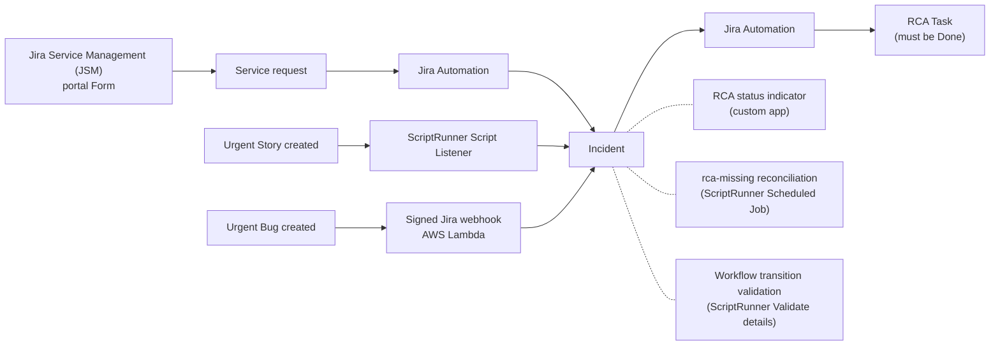
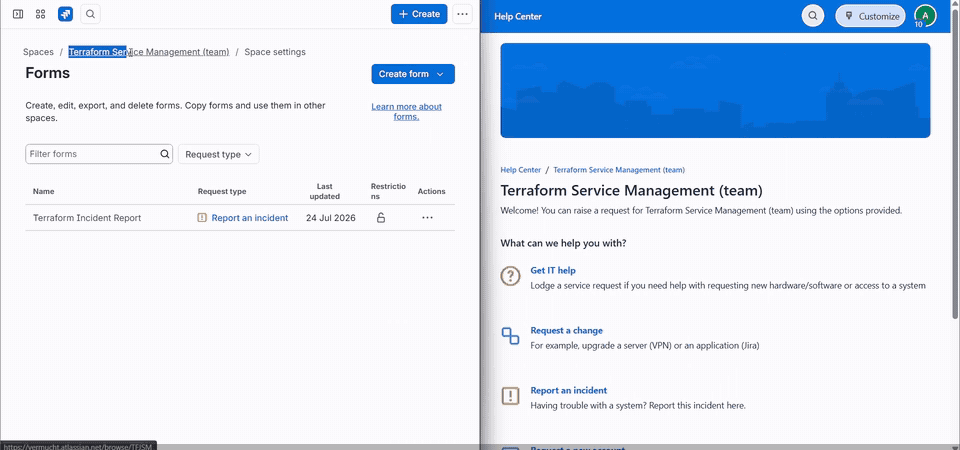
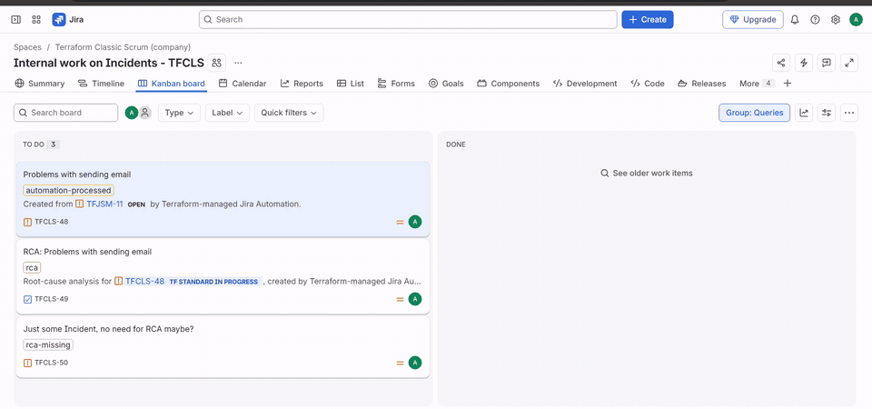
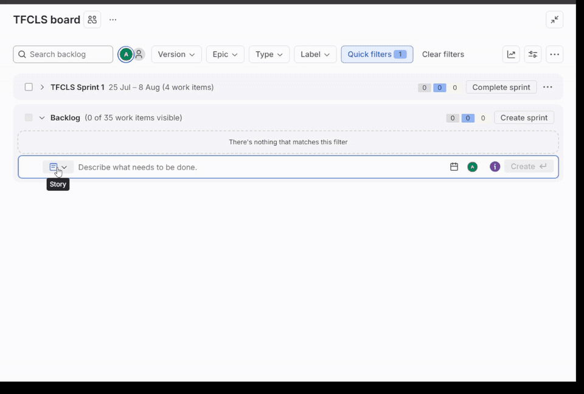
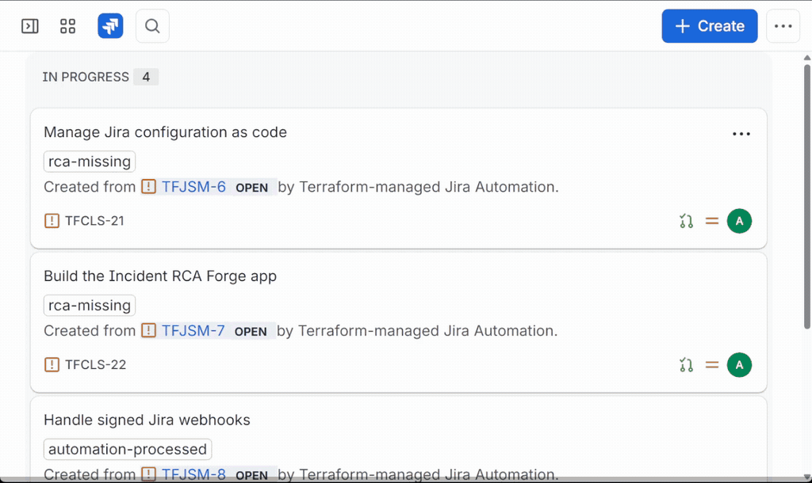

# Jira Cloud Incident/RCA automation experiments

This repository contains hands-on experiments with Jira Cloud administration
and automation: Terraform-managed configuration, Jira Automation flows,
ScriptRunner Cloud rules, a Jira custom app, a signed AWS webhook, and a
reproducible development container. The examples meet in a small Incident and
root-cause analysis (RCA) process but can also be reviewed independently.
[See the complete portfolio overview and reproduction paths.](OVERVIEW.md)

This is a portfolio demonstration rather than a proposed production
architecture. One small workflow connects several Jira extension approaches so
their responsibilities and trade-offs can be compared, while every experiment
remains independently reviewable.
[Compare the experiments and their results.](OVERVIEW.md#results-at-a-glance)

**▶ Watch:** blocks expand to short edited screen recordings of the processes
described in their sections.

---

### Incident/RCA workflow

---

### Service request intake

Terraform creates the **Terraform Incident Report** form and publishes it to the
customer portal of a team-managed Jira Service Management project (`TFJSM`).
The form captures structured incident context in a service request. Jira
Automation then creates and links an `Incident` in a company-managed Jira
Software project (`TFCLS`), and a second flow labels that Incident and creates
its linked RCA Task. Terraform also manages the projects, reusable schemes, and
both Automation flows. The recording follows one report from the published
portal form to all three linked work items.
[See the Terraform design and configuration.](terraform/README.md)

  
<strong>▶ Watch: Service request intake creates an Incident and RCA Task</strong>

   
  

---

### Workflow enforcement and reconciliation

The Incident workflow then enforces the business rule: an Incident cannot move
to Done until a linked RCA Task exists and is complete. ScriptRunner validators
provide explicit errors. A scheduled ScriptRunner job marks inconsistent open
Incidents with `rca-missing` instead of silently inventing or deleting
relationships. [See the ScriptRunner rules.](scriptrunner/README.md)

### RCA status indicator via custom app

A custom Jira app shows **RCA missing**, **RCA incomplete**, or **RCA
completed** directly on the Incident. The same state remains visible as a
compact badge when the panel is collapsed.
[See the custom app implementation.](custom-apps/incident-rca-status/README.md)

The recording connects the UI and policy layers: it shows an incomplete linked
RCA Task, the indicator changing to completed after that Task is closed, and a
second Incident marked `rca-missing` being rejected by the workflow validator.

  
<strong>▶ Watch: Workflow enforcement and RCA status indicator</strong>

   
  

---

### Incident creation via ScriptRunner

A ScriptRunner listener creates a linked Incident for an urgent Story if one
does not already exist, providing an entry point outside Jira Automation.
[See the listener implementation.](scriptrunner/script-listeners/create-incident-for-urgent-story/README.md)

### Incident creation via AWS Lambda

A signed AWS Lambda webhook creates a linked Incident for an urgent Bug,
validating the webhook's hash-based message authentication code (HMAC)
signature and using DynamoDB for idempotency. Both entry points feed the
resulting Incident into the same RCA workflow.
[See the signed webhook receiver.](webhook/webhook-receiver-aws-lambda/README.md)

  
<strong>▶ Watch: Incident creation via ScriptRunner and AWS Lambda</strong>

   
  

---

### GitHub integration

Branch names and pull request titles contain `TFCLS-*` work item keys. Jira's
GitHub integration uses those keys to associate development activity with the
corresponding Jira work items and display branches and pull requests in their
Development panel. The repository history includes demo pull
requests for [Terraform configuration](https://github.com/aleksei-sapozhnikov/jira_cloud_experiments/pull/1),
[Incident/RCA integrations](https://github.com/aleksei-sapozhnikov/jira_cloud_experiments/pull/2),
and the [combined portfolio](https://github.com/aleksei-sapozhnikov/jira_cloud_experiments/pull/3).

The recording starts with the connected repository, then follows a Jira work
item key to its matching GitHub branch and pull request and back to the populated
Development panel in Jira.

  
<strong>▶ Watch: GitHub integration associates development activity</strong>

   
  

---

### Implementation notes

Terraform manages the Jira spaces, reusable schemes, Form, and both Automation
flows. Human-readable JSON configuration is translated into site-specific Jira
IDs, and a second plan is clean. Small REST adapters cover capabilities missing
from the community provider without exposing those implementation details to
the root configuration. Workflow transitions are deliberately preserved after
creation because Jira stores ScriptRunner-owned rules inside them.
[See the Terraform reconciliation details and limitations.](terraform/README.md)

The responsibility boundaries remain explicit: Terraform owns stable
configuration, Jira Automation owns RCA creation, ScriptRunner owns workflow
policy and reconciliation, the custom app owns the contextual UI, and the
webhook receiver owns external event validation and idempotency.
[See the detailed experiment results and setup guides.](OVERVIEW.md)
